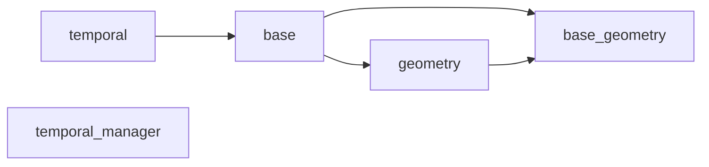
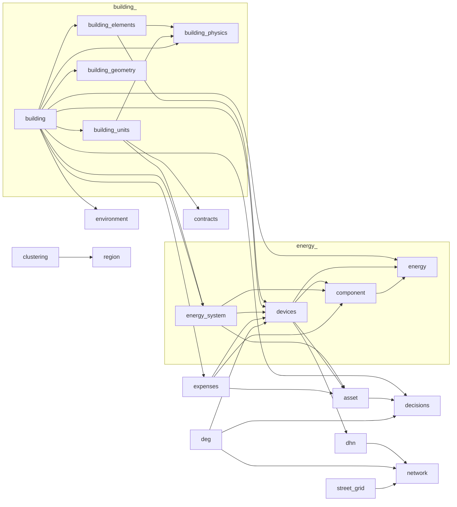

# Odeon

Odeon is a Python package developed within the Fraunhofer IEG **Enable** 
software suite for modeling, simulating, and analyzing buildings, energy 
systems, and their components. It provides a flexible object-oriented framework 
to represent buildings, building elements, energy flows, and related 
infrastructure such as district heating and electricity networks. Odeon 
represents the extensive data model used or compatible with the full Enable 
software suite. The development of Odeon was initiated and financed by the 
[ODH@Jülich](https://www.ieg.fraunhofer.de/de/projekte/odh-juelich.html) 
project.

---

## Features

- **Object-oriented modeling** of buildings, building units, and energy systems
- Support for building physics, geometry, and device modeling
- Tools for energy flow analysis and visualization (e.g., Sankey diagrams)
- Extensible with custom components and devices
- Integration with other **Enable** tools

---

## Installation

Clone the repository and install with pip:

```sh
git clone https://github.com/Fraunhofer-IEG/enable-odeon.git
cd odeon
pip install -e .
```

---

## Usage

Import Odeon classes and start modeling:

```python
from odeon.model import Project, Branch, Building, Household

# Create a project and a branch
my_project = Project()
my_branch = Branch(year=2023)
my_project.main_branch = my_branch

# Add a building and a household
my_building = Building()
my_household = Household()
my_building.add_building_units(my_household)
my_branch.add_objects(my_building)
```

See the [examples](./docs/examples/) directory for Jupyter notebooks 
demonstrating typical workflows.

---

## Documentation

- **API Reference:** See the docstrings in the code and the [docs](./docs/) 
folder.
- **Examples:** Jupyter notebooks in [docs/examples](./docs/examples) cover 
building modeling, energy systems, and device integration.

---

## Package dependency

> **Info:**
> - filled lines: explicit imports
> - dashed lines: type checking imports, or reverse imports with `import odeon.models as om`

### Base classes



### Everything else

> **Note:** Dependencies of packages from the base classes aren't shown.




---

## Contributing

Contributions, bug reports, and feature requests are welcome!  
Please open an issue or pull request on this repository.

---

## License

See [LICENSE](./LICENSE) for details.

---

## Contact

For questions or collaboration, please contact the Enable project team: 
[enable@ieg.fraunhofer.de](mailto:enable@ieg.fraunhofer.de).