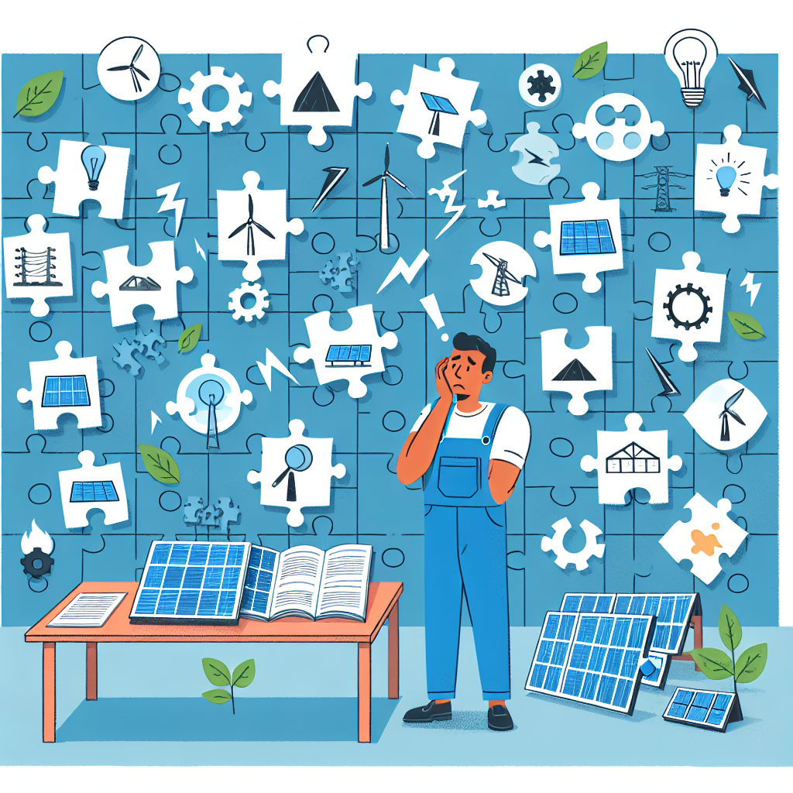
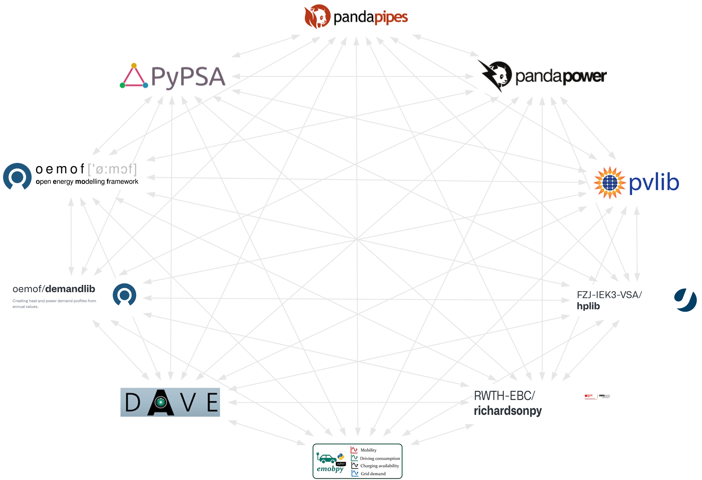
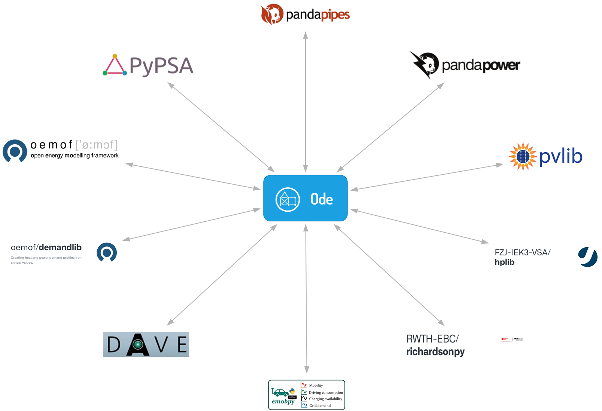
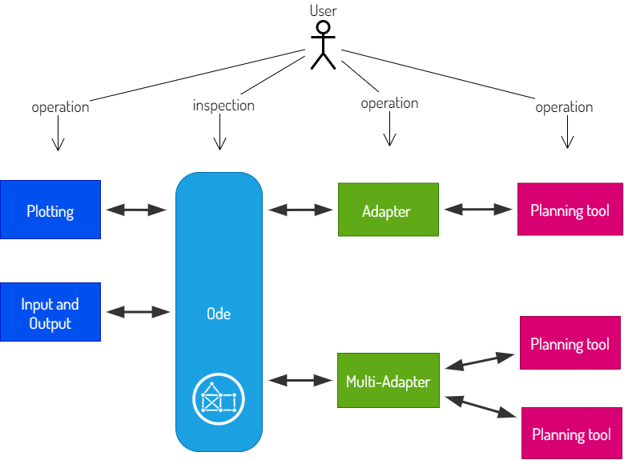

!!! warning "Under Construction"

    This documentation is still under construction and will receive major 
    additions and changes in the future. Please be considerate with us and the 
    documentation. However, if you already have any tips and remarks or if you 
    miss some super important aspects, we'd love to hear from you.

# Motivation

<figure markdown="span">
  { width="400" }
  <figcaption>The problem: Solving the energy system planning jigsaw.</figcaption>
</figure>

The transformation of the energy system from fossil fuels to renewable energy 
sources faces numerous challenges. While fossil fuels offer flexible, 
on-demand energy, renewable energy sources are often characterized by fluctuations 
in both spatial and temporal dimensions. Therefore to integrate renewable energies 
efficiently in modern systems, a high temporal overlay of the produced and consumed 
Energy is required. These inherent characteristics of renewable energy introduce 
complexities in energy system stability, reliability, and planning. 

## Energy system planning for districts

A large proportion of energy consumption for heating, electricity or mobility is 
consumed within buildings, cities and municipalities. Sector coupling 
- the integration of heating, electricity, and mobility sectors - has emerged as 
a promising strategy to enable efficient utilization of renewable energy and 
enhancing system flexibility. This is possible due to the interconnection of 
diverse consumers and an accessability of additional storage capactities.
How-ever, integrating fluctuating renewable energy sources into energy systems 
requires careful planning of energy carrier utilization, distribution, 
transformation, and storage. This complexity demands advanced planning tools 
and methods capable of addressing diverse system requirements across multiple 
scales and sectors.

Such planning applications can include following stages and methods:

- Identification of the **demands** of the various sectors at different scaling and
  aggregation levels
- Mapping of the diverse **renewable energy potentials** and their temporal and
  spatial characteristics (solar energy, geothermal energy, wind energy, etc.)
- Investigation of **integration options** for renewable energy sources
- Designing of **integrated energy systems** and development of **operating strategies**
- Analysis of the effects of both **consumer behavior** and producers on energy
  grids
- Assessment of the potential for **district heating expansion**
- Development of new **business models**

These challenges result in an increased heterogeneity of planning processes.
Planning tools and methods must respond to these requirements by being flexibly
applicable and adaptable for a wide variety of processes.

## Tools in use

Numerous open-source planning tools already exist to perform specific planning
steps effectively, such as:

| Tool         | Description                                                              |
| ------------ | ------------------------------------------------------------------------ |
| Demandlib    | BDEW energy demand profiles[^1]                                          |
| Oemof        | Modular framework for energy system optimization[^2]                     |
| Pvlib        | Models and analyzes photovoltaic systems[^3]                             |
| Pandapipes   | Simulation of networks for district heating/cooling or gas networks[^4]  |
| Pandapower   | Simulates and optimizes power grids[^5]                                  |
| Heatopia     | Design and operation optimization of district heating networks[^6]       |
| hplib        | Data & simulation of Heatpump parameters based on public datasets[^7]    |
| DAVE         | Tool for data aggregation and energy network models[^8]                  |
| richardsonpy | Stochastic occupancy & electric load profiles for residential houses[^9] |
| emobpy       | Battery electric vehicle time series[^10]                                |
| LPG          | Load profile generation by behavioural user simulation[^11]              |

In modern planning applications many different tools, data sources and forms of the data
are required to meet the challanges of these applications. Often it is addinionally needed,
to be corectly transformed and interpreted to use it within different tools or methods.
This linking of many tools to achieve integrated energy system planning requires many adjusted
adapters and aggravate the building of coherent data base, as shown in this image:

<figure markdown="span">
  { width="800" }
  <figcaption>Part of the open source tool landscape with all possible connections between the tools listed.</figcaption>
</figure>

## The need for a central data model

While the development of individual tools is progressing rapidly, the exchange
of data between tools is often not standardized and requires the definition of
many interfaces. A central management tool for data handling, analysis and integration
within workflows would be needed to facilitate their practical integration in
energy planning processes. Challanges for the communication between different 
tools can consist of problems as following: 

- Data diversity is increasing due to sector-coupling and the growing complexity
  of specialized tools
- Data that is exchanged between tools must be communicated and interpreted
  correctly
- Planning processes usually requires complex interfaces between involved tools
  in order to exchange data
- Adapters between specific tools cannot simply be adapted to other tools.

A combined tool consisting of data management library and data model is needed 
that is able to depict all required entities and their relationships but also 
serves as a tool that provides functionalities like dynamically interpreting,
aggregating or translating of data to allow seamless integration of various
tools and applications. To adress this necessity the **open-source library Odeon**
was build, to serve as a central data management for linking planning steps and 
enabling the dynamic exchange of data for building simulation, energy demand 
analyses, potential surveys, heat network planning and energy system planning:

<figure markdown="span">
  { width="800" }
  <figcaption>Visualization of the reduced required connections using a centralized data model.</figcaption>
</figure>

However, Odeon doesn't provide direct adapters to any mentioned planning software.
Rather, individual adapters are needed per tool (or for mulitple tools at once) that 
allow for a translation between data represented in Odeon and required inputs just as 
created output in a tool-specific representation:

<figure markdown="span">
  { width="800" }
  <figcaption>The role of Odeon as a central data model: Adapters are necessary to translate between Odeon and business tools for planning tasks.</figcaption>
</figure>

<!-- Footnotes -->

[^1]: https://demandlib.readthedocs.io/en/latest/
[^2]:
    S. Hilpert, C. Kaldemeyer, U. Krien, S. Günther, C. Wingenbach, G.
    Plessmann, The Open Energy Modelling Framework (oemof) - A new approach to
    facilitate open science in energy system modelling, Energy Strategy Reviews,
    Volume 22, 2018, https://doi.org/10.1016/j.esr.2018.07.001.

[^3]:
    Anderson, K., Hansen, C., Holmgren, W., Jensen, A., Mikofski, M., and
    Driesse, A. “pvlib python: 2023 project update.” Journal of Open Source
    Software, 8(92), 5994, (2023). DOI: 10.21105/joss.05994.

[^4]:
    Lohmeier, D.; Cronbach, D.; Drauz, S.R.; Braun, M.; Kneiske, T.M.
    Pandapipes: An Open-Source Piping Grid Calculation Package for Multi-Energy
    Grid Simulations. Sustainability 2020, 12, 9899.

[^5]:
    L. Thurner, A. Scheidler, F. Schäfer et al, pandapower - an Open Source
    Python Tool for Convenient Modeling, Analysis and Optimization of Electric
    Power Systems, IEEE Transactions on Power Systems,
    DOI:10.1109/TPWRS.2018.2829021, 2018.

[^6]:
    M. Sporleder, M. Rath, M. Ragwitz, Solar thermal vs. PV with a heat pump: A
    comparison of different charging technologies for seasonal storage systems
    in district heating networks, Energy Conversion and Management: X, Volume
    22, 2024, 100564, ISSN 2590-1745,
    https://doi.org/10.1016/j.ecmx.2024.100564.

[^7]: Tjaden, T., Hoops, H., Rösken, K. “RE-Lab-Projects/hplib: heat pump library (v2.0)”. Zenodo (2021). https://doi.org/10.5281/zenodo.5521597

[^8]:
    Banze, T. “DaVe - Ein Softwaretool zur automatisierten Generierung von
    regionalspezifischen Stromnetzen, basierend auf Open Data,” -1, 2020.
    https://publica.fraunhofer.de/handle/publica/283381.

[^9]:
    I. Richardson, M. Thomson, D. Infield, A high-resolution domestic building
    occupancy model for energy demand simulations, Energy and Buildings 40 (8)
    (2008) 1560 1566.

[^10]:
    Gaete-Morales, C. (2021). An open tool for creating battery-electric vehicle
    time series from empirical data - emobpy (0.5.4). Zenodo.
    https://doi.org/10.5281/zenodo.4793312

[^11]:
    Pflugradt, N.; Platzer, B. Behavior based load profile generator for
    domestic hot water and electricity use Innostock 12th International
    Conference on Energy Storage, Lleida (Spanien), 2012, ISBN 978-84-938793-4-1
