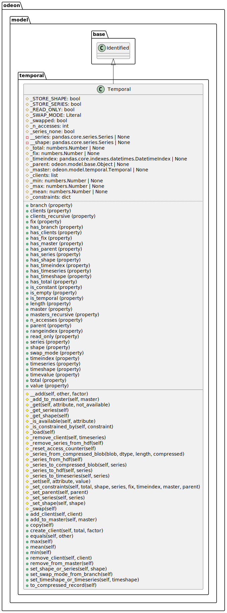

<!-- prettier-ignore -->
::: odeon.model.temporal
    handler: python
    options:
      show_root_toc_entry: false

## UML

<figure markdown="span">
  { width="90%" }
</figure>

### Operation effect overview

- "-" : will be kept / no changes
- "x" : will be updated
- `None`: will be cleared / set to `None`
  
| Attribute to set      | total part / sum | constancy (`fix`) | relative part | explicit timeindex | parent & implicit timeindex | Requirements                    |
| --------------------- | ---------------- | ----------------- | ------------- | ------------------ | --------------------------- | ------------------------------- |
| `total`               | x                | `None`            | -             | -                  | -                           |                                 |
| `fix`                 | x                | x                 | x             | -                  | -                           |                                 |
| `relative_series`     | -                | `None`            | x             | -                  | -                           |                                 |
| `series`              | x                | `None`            | x             | -                  | -                           |                                 |
| `relative_timeseries` | -                | `None`            | x             | if no parent       | -                           | parent is None or index matches |
| `timeseries`          | x                | `None`            | x             | if no parent       | -                           | parent is None or index matches |
| `parent` (!=None)     | -                | -                 | -             | `None`             | x                           |                                 |
| `master` (!=None)     | -                | `None`            | `None`        | `None`             | -                           | parents in same branch          |