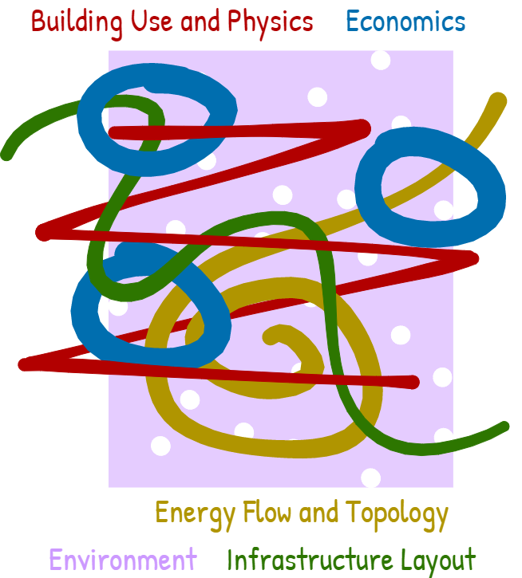

# Odeon

This is the documentation for the Python package **Odeon** developed within the 
Fraunhofer IEG Enable software suite for modeling, simulating, and analyzing 
buildings, energy systems, and their components. It provides a flexible 
object-oriented framework to represent buildings, building elements, energy 
flows, and related infrastructure such as district heating and electricity 
networks. Odeon represents the extensive data model used or compatible with the 
full Enable software suite. The development of Odeon was initiated and financed 
by the [ODH@Jülich](https://www.ieg.fraunhofer.de/de/projekte/odh-juelich.html) 
project.

<figure markdown="span">
  { width="500" }
  <figcaption>Artistic impression of Odeon</figcaption>
</figure>

!!! warning "Under Construction"

    This documentation is still under construction and will receive major 
    additions and changes in the future. Please be considerate with us and the 
    documentation. However, if you already have any tips and remarks or if you 
    miss some super important aspects, we'd love to hear from you.

## Background and Motivation

What is Odeon and why do you need it? We explain our motivation for Odeon in 
the section [motivation](about/motivation.md), as well as a compare its 
applicability with existing data models.

## User Guide

If you are looking for more details about Odeon and what can be done with it or
how it is structured please find our [introduction](user_guide/introduction.md)
in the _User Guide_ section for further details.

## Examples

If you already have a basic understanding of what Odeon is and want to get some
easy code impressions how Odeon is used please have a look at our
[examples](examples/project_and_branches.ipynb).

## Code Documentation

If you are a developer or want to have a look into the generated code
documentation please choose the module of your intrest within the
[Code Documentation](code_documentation/base.md) section from the navigation 
bar on the left.

## License

Odeon is distributed under the [BSD 3-Clause License](about/licence.md)
