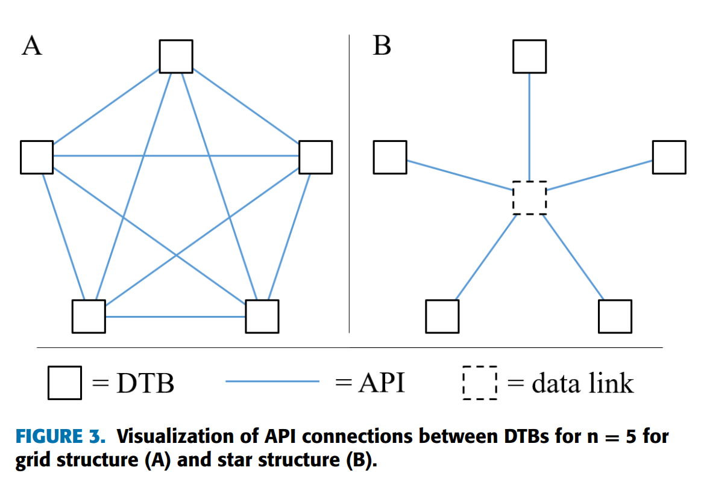

!!! warning "Under Construction"

    This documentation is still under construction and will receive major 
    additions and changes in the future. Please be considerate with us and the 
    documentation. However, if you already have any tips and remarks or if you 
    miss some super important aspects, we'd love to hear from you.

# Introduction

This section is supposed to provide some basic information about Odeon and is
a good start if you are new to it and want to learn what it is intended for and how to use it.

## What is Odeon and what can you do with it

Odeon is the implementation of a data model in the context of "Energetic District
Planning" as class models in Python. In the context of district planning, Odeon is
primarily used for concept development and preliminary design of energy systems
and their components. These steps are carried out at the beginning of the life
cycle of a district or during retrofitting/renovation. Districts/projects with
their buildings, facilities, areas, potential for renewable energy sources and
infrastructures can be mapped. The mapping of different variants/energy supply
concepts of a district is also possible through defining various `branches`.

<figure markdown="span">
  { width="300" }
  <figcaption>ODEON is applicable to a variety of district types</figcaption>
</figure>

The planning phase can include different process steps, so it makes sense that
these do not have direct interfaces with each other, but all have an interface
to the data model, as described for digital twins.

<figure markdown="span">
  { width="300" }
  <figcaption>A consistent structure is needed for complex planning tool chains</figcaption>
</figure>
In this sense, Odeon forms the basis for creating a 'single source of truth' for
the processing of district planning projects.

<figure markdown="span">
  { width="300" }
  <figcaption>ODEON can provide a solid data model for Energetic District Planning</figcaption>
</figure>

## Which modules are included in Odeon

- [Asset](../code_documentation/asset.md): _Defines classes and logic for representing and managing assets bundling economic data, location and decisions for energy system objects_
- [Base](../code_documentation/base.md): _Describing the highest (in terms of most abstract) level of `Object`s as well as `Project` and `Branch`es_
- [BaseGeometry](../code_documentation/base_geometry.md): _Describing how to use geometrical data in ODE_
- [Building](../code_documentation/building.md): _Describing all forms of buildings including their sites and abstract objects called `Structures`_
- [BuildingElement](../code_documentation/building_element.md): _Describing parts as `Wall`s, `Roofs`s, `Window`s, etc. that form the building - documentation page is **WIP**_
- [BuildingGeometry](../code_documentation/building_geometry.md): _Describing the building's outer geometry_
- [BuildingPhysics](../code_documentation/building_physics.md): _Describing thermal properties of the building such as thermal transmittance etc. - documentation page is **WIP**_
- [BuildingUnit](../code_documentation/building_unit.md): _Describing `Household`s or `Commercial` units that can be placed in the building - documentation page is **WIP**_
- [Clustering](../code_documentation/clustering.md): _Describes the clustering of stored groups_
- [Component](../code_documentation/component.md): _Describes components — such as technical devices or subsystems — that make up energy systems_
- [Contract](../code_documentation/contract.md): _Describes the contract classes - documentation page is **WIP**_
- [Decision](../code_documentation/decision.md): _Describes Decisions in ODEON - documentation page is **WIP**_
- [Device](../code_documentation/device.md): _Describing all form of devices that are relevant for energetic district planning_
- [DistrictElectricityGrid](../code_documentation/district_electricity_grid.md): _Describes the structure and usage of the electric grid for districts - documentation page is **WIP**_
- [DistrictHeatingNetwork](../code_documentation/district_heating_network.md): _Describes the structure and usage of the heating network for districts - documentation page is **WIP**_
- [Energy](../code_documentation/energy.md): _Defines classes and logic for representing, managing, and calculating energy carriers, energy flows, and related properties_
- [EnergyNetwork](../code_documentation/energy_network.md): _Defines classes and logic for representing, managing, and analyzing energy networks, such as district heating or electricity grids_
- [EnergySystem](../code_documentation/energy_system.md): _Defines classes and logic for representing, configuring, and managing energy systems, including their components and interactions_
- [Environment](../code_documentation/environment.md): _Describes environmental influences like Weather - documentation page is **WIP**_
- [Expense](../code_documentation/expense.md): _Describes the usage of the expenses object - documentation page is **WIP**_
- [Geometry](../code_documentation/geometry.md): _Describing general geometry for all forms of geometric parts in particular `Element`s (`Wall`s, `Roof`s, ...)_
- [Network](../code_documentation/network.md): _Describing the highest (in terms of most abstract) level of `Network`s. All our concrete Networks (`DistrictElectricityNetwork`, `DistrictHeatingNetwork`, `StreetGrid`) will inherit from this._
- [Region](../code_documentation/region.md): _Describes storages for central points and spacial objects_
- [StreetGrid](../code_documentation/street_grid.md): _Describing all inside
  the boundary `Streets` as one Network - documentation page is **WIP**_
- [Temporal](../code_documentation/temporal.md): _Descriping efficient use of temporal data, such as time series_
- [Waters](../code_documentation/waters.md): _Describing stretches of running or stagnant waters for further re-potential analysis_
