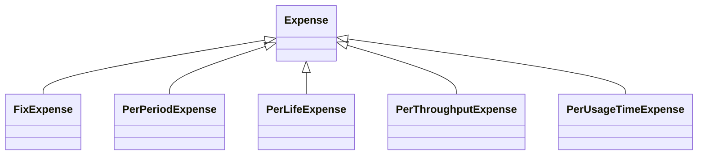

!!! warning "Under Construction"

    This documentation is still under construction and will receive major 
    additions and changes in the future. Please be considerate with us and the 
    documentation. However, if you already have any tips and remarks or if you 
    miss some super important aspects, we'd love to hear from you.

!!! warning "To-dos"

    - How to use and calculate them

# Expenses
Expenses in Odeon reflect all costs of a comonent within the considered Energy System. They store the economical Data in the Odeon Object and can be used for calculations like Costing and for investment decisions.
Expenses can be subdivided into various types:

### Types of Expenses
- *CAPEX*: Capital Expenditures include all expenses for investments that are generally incurred at the beginning of the reviewed period. They can consist of investment costs for components and installation costs.
- *OPERATION*: Operational Expenditures (OPEX) include all expenses that are incurred during the reviewed period. Usually they consist of costs for raw materials and fuels, personnel costs and energy costs. 
- *MAINTENANCE*: Maintenance costs are also incurred during the reviewed period, but do not directly serve the operation of the system. They must be paid in order to ensure basic operational functionality. Costs for replacement parts or cleaning can be maintenance costs.
- *COMMODITY*: Commodity expenses are the fluctuating costs of goods like natural resources, fuels or electricity in the market.
- *REVENUE*: Revenue Expenditures include all short-term costs of the System to insure its day-to-day oprerationabillity. It can consist of sallarys, rental costs, utilities and similar costs.
- *FUNDING*: Funding expenses includes repayment and interest payments of a loan or similar funding used to invest, maintain or operate the System.
- *OTHER*: Other exoenses is used for all other costs and payment that not belong to one of the forementioned Types.
- *UNKNOWN*: If the detailed structure of the costs or payments is unknown or can not be categorized in other ways, this Type is used.

##
Costs and Expenses can further be divides in different classes:

### Expense classes

- `FixExpense`: FixExpenses are not dependent on other variables and always occur at the same fixed amount. Generally investment costs for components or installation costs are considered FixExpenses.
- `PerPeriodExpense`: PerPeriodExpenses are due once in a period, for example once per year. They can consist of a fix Part and a variably Part dependent on the dimension of the Asset. Periodical Maintenance costs or labor costs are typical PerPeriodExpenses.
- `PerLifeExpense`: PerLifeExpenses are due once per lifetime of an Asset. This can correspond with the periods in your calcutaion, but often the Lifetime of an Asset comprises several periods. They may depend on the Asset's dimension or other attributes. Replacement costs are an example of PerLifeExpenses.
- `PerThroughputExpense`: PerThroughputExpenses are dependent on the amount of input of the Asset. Typically operating costs like fuelcosts or electricity costs for the components are considered Per ThroughputExpenses.
- `PerUsageTimeExpense`: PerUsageTimeExpenses only incurre per hour the Asset is being used. Examples can be special usage or rental costs.