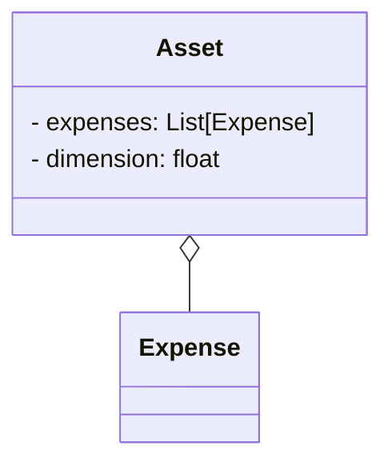

!!! warning "Under Construction"

    This documentation is still under construction and will receive major 
    additions and changes in the future. Please be considerate with us and the 
    documentation. However, if you already have any tips and remarks or if you 
    miss some super important aspects, we'd love to hear from you.

!!! warning "To-dos"

    - Describe Assets
    - Link to Expenses
    - Link to Decisions

# Assets
- This Site describes the economical Data of Odeon Objects. Every `Device` and component of the Energy System like the heat grid, a heat pump or PV-system in Odeon is also an `Asset`. It stores the given economical data of the Device within the Object as `Expenses` or `Decisions`.
- [Expenses](expenses.md) include all costs of the Object like the capital cost and opeational costs of the given component. Investment costing methods can be applied and Expenses can be stored as cash values or annuities. 
- [Decisions](options_decisions.md) include the options to buy and build a components based on the given costs and economic data. If a decision to build a component is made, the scaling and dimensions of the component can also be considered and optimized. 

- For other methods for economic calculations or usefull Tools for data processing, see the page [Processing](../../processing/processing.md)