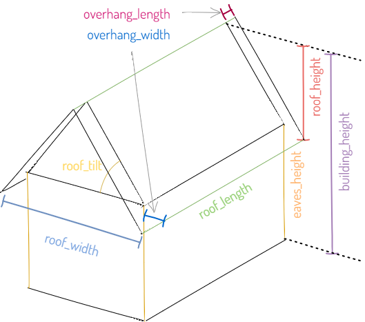
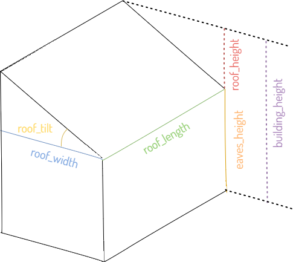
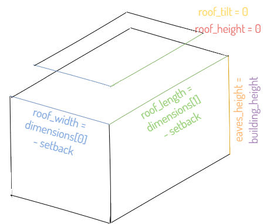

!!! warning "Under Construction"

    This documentation is still under construction and will receive major 
    additions and changes in the future. Please be considerate with us and the 
    documentation. However, if you already have any tips and remarks or if you 
    miss some super important aspects, we'd love to hear from you.

!!! warning "To-dos"

    - formulate key points
    - check examples
 
# Building geometry

- Odeon allows to store two types of building geometry models:
  `FootprintNominalBuildingGeometry` and `RoofedCuboidBuildingGeometry`. For a
  building, both of them can exist at the same time. They can also contradict
  each other – it's the user's responsibiliy to know which model to trust for
  which task. Odeon also provides methods to convert each building geometry model
  to the other (overwriting any possibly existent information in the latter).

## Footprint-Nominal Building Geometry

- The `FootprintNominalBuildingGeometry` consists of a footprint geometry and
  additional nominal attributes like building height, number of floors, roof
  type, eaves' height etc. The footprint geometry must be an Odeon `Geometry`
  containing a Shapely Polygon without holes. Specifically, MultiPolygons are
  not allowed, i.e. it's impossible to store a geometry to a building that
  consist of multiple separate building parts. Rather, it's necessary to split
  the building into multiple buildings with each having a simple Shapely Polyon
  (and optionally grouping them to a `StructureGroup`).

## Roofed Cuboid Building Geometry

- The `RoofedCuboidBuildingGeometry` consists of a cuboid with a roof and
  represents a simplified building geometry model that can be, due to its
  simplicity, useful for some calculations.
  - The cuboid consists of a rectangular footprint and for walls.
  - The roof can be either a _flat roof_, a _shed roof_ or a _gabled roof_.
    Accordingly, these roofs will contribute one (for flat roof, shed roof) or two
    (for gabled roof) individual roof rectangles.
  - The gable area – i.e. vertical building elements between the base cuboid and
    the inclined or flat roof polygons – are not represented.
- Each wall can contain 0 or 1 windows and 0 or 1 doors. If in reality, multiple
  window areas exist for a wall, the user might want to sum their areas. The
  position of the windows and doors in the walls are assumed to be irrelevant
  for any calculations. In (3D) plots, windows might be placed at the center of
  a wall for presentation reasons.
- Similarly, each roof rectangle can contain up to one window. For these window,
  it can be stated whether they are tilted just as their hosting rectangles
  (i.e. they are in plane) or whether they are vertical (e.g. dormer windows).

<figure markdown="span">
  { width="300" }
  <figcaption>Roof type "Gable"</figcaption>
</figure>

<figure markdown="span">
  { width="300" }
  <figcaption>Roof type "Shed"</figcaption>
</figure>

<figure markdown="span">
  { width="300" }
  <figcaption>Roof type "Flat"</figcaption>
</figure>

## Transforming Building Geometries

- Odeon provides a method to convert a `FootprintNominalBuildingGeometry` of a
  `Building` to a `RoofedCuboidBuildingGeometry`. This methods requires the
  presence of several attributes of the `FootprintNominalBuildingGeometry` to be
  calculable and unambiguous.

???+ example

    ```python
    from odeon.model import FootprintNominalBuildingGeometry, RoofedCuboidBuildingGeometry, Geometry, Building, RoofType
    from odeon.processing.building_geometry import geometry_creatable, footprint_nominal_to_roofed_cuboid
    from shapely import Polygon

    # TODO work on the following and check:

    fnbg = FootprintNominalBuildingGeometry(...)
    fnbg.footprint = Polygon([[0,10], [10, 10], [10, 0], [0, 0], [0, 10]])
    fnbg.roof_height = 2
    fnbg.eaves_height = 5
    fnbg.roof_type = RoofType.SHED

    b = Building()
    b.footprint_nominal_geometry = fnbg

    geometry_creatable(fnbg) # returns whether the model is calculable with the provided data

    footprint_nominal_to_roofed_cuboid(building) # this will create building elements and add them to the Roofed Cuboid Model
    ```

## Site geometry

- In Odeon, `Site`s also have geometry models in form of instances of `Geometry`
  or inherited classes. The Shapely geometry of a `Site`'s `Geometry` must be a
  Polygon, MultiPolygons are not supported.
