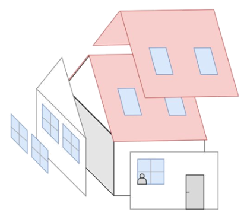
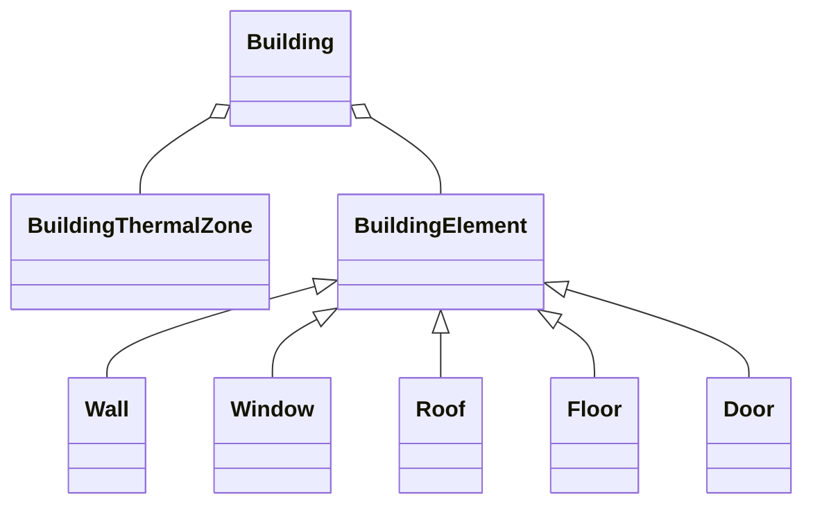
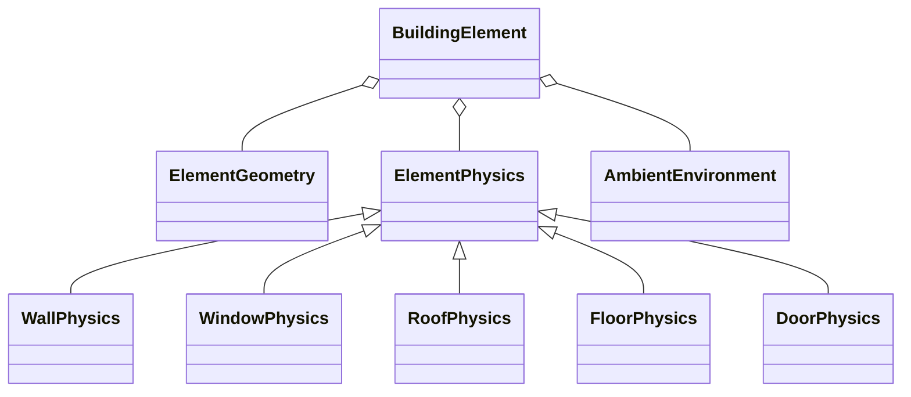

!!! warning "Under Construction"

    This documentation is still under construction and will receive major 
    additions and changes in the future. Please be considerate with us and the 
    documentation. However, if you already have any tips and remarks or if you 
    miss some super important aspects, we'd love to hear from you.

# Building Envelope & Physics

## General

<figure markdown="span">
  { width="250" }
  <figcaption>The thermal envelope of a building consists of walls, roofs, buildings, floors, ceilings and doors.</figcaption>
</figure>

For describing the thermal envelope of a building and additional physical attributes, Odeon provides several classes.
These can be used to calculate heating and cooling demands by estimations or thermal simulation, to determine storage characteristics of the building, or to identify refurbishment potentials of specific components of the building envelope.

As we've seen in the [Buildings](buildings.md) section, the component description of a building is divided into `BuildingElement`s like `Wall`s, `Window`s, `Roof`s, `Floor`s, and `Door`s, each having an `ElementGeometry`. The thermal attributes of these building elements are described by classes for `ElementPhysics`.

Moreover, the class `BuildingThermalZone` can store general data on a building's thermal zone.

## BuildingThermalZone

The `BuildingThermalZone` describes the physical attributes of a zone inside the building, including:

- `heated_volume`
- `internal_heat_capacity`
- `air_exchange_rate_use`
- ...

Right now, a building can have only one `BuildingThermalZone`.

## ElementPhysics

As mentioned in [Buildings](buildings.md) each `Building` can be described by `BuildingElement`s for a higher level of detail.
To represent the physical properties of every `BuildingElement`, the class `ElementPhysics` is defined. It holds all physical attributes of the `BuildingElement`.  

Since the `ElementPhysics` of different instances of `BuildingElement`s is usually described by different attributes, each `BuildingElement` has its own class that inherits from `ElementPhysics`.

