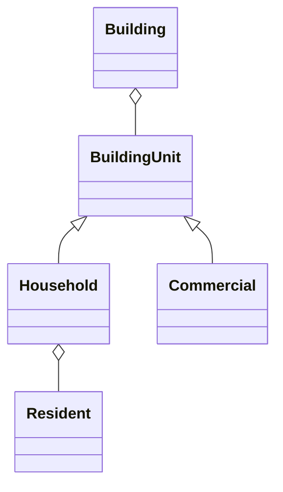

!!! warning "Under Construction"

    This documentation is still under construction and will receive major 
    additions and changes in the future. Please be considerate with us and the 
    documentation. However, if you already have any tips and remarks or if you 
    miss some super important aspects, we'd love to hear from you.

# Building Units

A Building may contain several `BuildingUnit`s. It must be pointed out, that
they are not assigned to a specific location in the building. As well as the
Building itself, it can hold energy demands. There are two types of
`BuildingUnit`s, a `Household`, which can contain `residents` and a `Commercial`,
which holds a `CommercialType` and a scaling_reference. As a Building can
contain several `BuildingUnit`s, it is possible to easily define mixed usages.
As described in the section above, this mixed usage as well as the residential
or commercial use will be detected by the building, even if you did not specify
the attribute `Use` in the Building.



## Households

A `Household` describes a residential `BuildingUnit`. It has the attribute `size`, that determins the number of `residents`. These `residents` can have different `ResidentAgeGroups` and different `SourceOfIncome`.

## Commercials

`Commercial`s can have different `CommercialType`s. These include e.g. office, construction, school, hospital, local authorities etc..
As the energy demands highly depend on the size of the `Commercial`, an attribute `ScalingReference` can be added. The unit of the `ScalingReference` depends on the `CommercialType`. E.g. the scaling of a school depends on the number of pupils, a hospital on the number of beds or a company on the number of employees. 

## Energy demands
Each `BuildingUnit` can hold different energy demands:
- `electricity_demand`: Electricity demand
- `heating_demand`: Heating demand
- `dhw_demand`: Domestic hot water demand
- `cooling_demand`: Cooling demand

The demands do not necessarily have to be assigned to each `BuildingUnit` but can also be added at the building level. 

## Floor Area

A `BuildingUnit` can have a netto floor area (`net_floor_area`)given in the unit of m². The netto floor area can be inherited from the `usable_area_unassigned` of a parent (`Building`) or just be set, if the netto floor area of each `BuildingUnit` is known. 

???+ example

    ```py title="Create a single family home with 3 floors"
    from odeon.model import Building, BuildingType
    from odeon.model.building_units import Household, Resident

    # Create a single family home with 3 floors
        mybuilding = Building(name="sfh", number_of_floors=3)
        mybuilding.building_type = BuildingType.TERRACED

        # Create a household and add building unit
        household = Household(name="sfh_household")
        mybuilding.add_building_units(household)

        # Add resident
        r = Resident(name="Maxime Musterfrau", age=29, source_of_income="occupied")
        household.add_residents(r)

        # Assigns a usable area to the building
        mybuilding.usable_area = 90
    ```

???+ example

    ```py title="Create a commercial, e.g. office block with 10 floors"
    from odeon.model import Building, BuildingType
    from odeon.model.building_units import Household, Resident, Commercial

    # Create a building with 10 floors:
        myoffice = Building(name="myoffice", number_of_floors=10)
        myoffice.building_type = BuildingType.HIGHRISE

    # adds commercialtype building units to the building:
        for i in range(10):
            office = Commercial(name=f"officeblock_office{i+1}")
            myoffice.add_building_units(office)
    ```


???+ example

    ```py title="Create Building with mixed use (e.g. a Restaurant and 3 households)"

    from odeon.model import Building, BuildingType
    from odeon.model.building_units import Household, Resident, Commercial

    # Create Building with 4 floors
        mymixedbuilding = Building(name="mixedbuilding", number_of_floors=4)
        mymixedbuilding.building_type = BuildingType.DETACHED

        # Create a restaurant:
        restaurant = Commercial(name="mixedbuilding_restaurant")
        mymixedbuilding.add_building_units(restaurant)

        # Add households
        for i in range(3):
            household = Household(name=f"mixedbuilding_household{i+1}")
            mymixedbuilding.add_building_units(household)
    ```