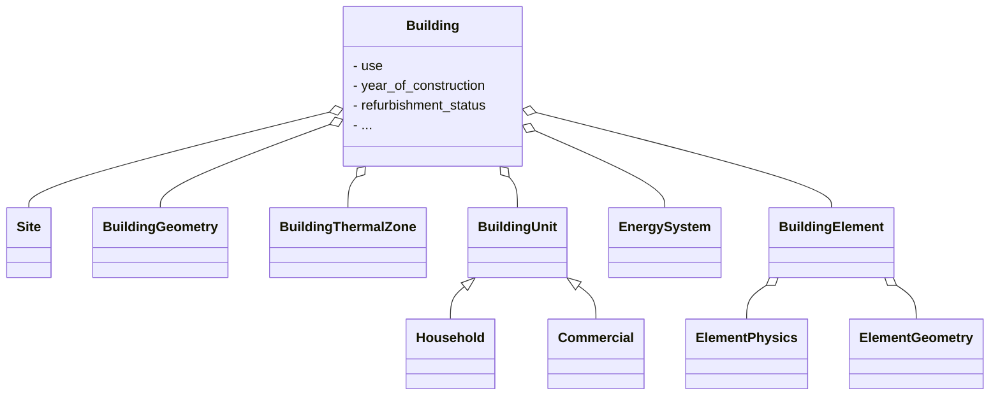
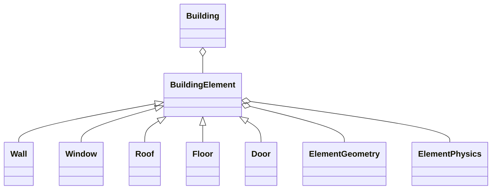

!!! warning "Under Construction"

    This documentation is still under construction and will receive major 
    additions and changes in the future. Please be considerate with us and the 
    documentation. However, if you already have any tips and remarks or if you 
    miss some super important aspects, we'd love to hear from you.

# Buildings

This page will give a short introduction about the idea of **Buildings in Odeon**
and how they are structured within.

## Overall structure

In Odeon, the `Building` class is used to represent all possible types of buildings. For
this purpose, there are several attributes defined to specify the buildings'
characteristics such as building use, building type, building age groups, the
efficiency level of the building and the refurbishment status.

In addition, there are other entities, which can be assigned to a building and specify
several aspects in more detail, such as `BuildingUnit`s, `BuildingGeometry`, and
so on. For all implemented possibilities, have a look at the code documentation
of the [Building](../../../code_documentation/building.md). Even if it is possible
to define the attributes and entities directly, the building provides
possibilities to define several properties directly. You might have the feeling
of overdetermination, but the building class will handle this. To give an
example: there are building age groups, but if you have the information about
the actual construction year or only a range, you can provide it as
'year_of_construction' or 'year_of_construction_range' and the property
'building_age_group' will map to the right building age group automatically as
needed.

In Odeon, it is possible to define buildings with a detail level of LOD 0.0 to LOD
2.1-3.1. For this purpose, the building geometry can be defined as well as
several types of building elements, the number of floors and one thermal zone
per building.

## Basic attributes

| Class                                | Description                                                                                                                                                                                                                                                                                                                       |
| ------------------------------------ | --------------------------------------------------------------------------------------------------------------------------------------------------------------------------------------------------------------------------------------------------------------------------------------------------------------------------------- |
| `EfficiencyLevel`                    | This class represents various energy efficiency standards for buildings in Germany over different years and other related efficiency classifications. The compose of various building parameters derived from the standards set by Wärmeschützverordnung (WSVO), Energieeinsparverordnung (EnEV), and Gebäudeenergiegesetz (GEG). |
| `BuildingAgeGroup`                   | This class categorizes buildings into different age groups based on their construction years. These age groups are defined based on two different classification systems: the Tabula building age groups and the ENOB.                                                                                                            |
| `RefurbishmentStatus`                | This class categorizes the status of a building's refurbishment into three different levels based on Tabula data; existing state, standard refurbishment & ambitious refurbishment.                                                                                                                                               |
| `BuildingType`                       | This class categorizes different types of buildings based on their structure (i.e., if the building is detached, terraced, or a highrise, etc.).                                                                                                                                                                                  |
| `Address`                            | This class provides the possibility to add the address of a building with the usual input (e.g. street, housenumber, postalcode, country, etc.).                                                                                                                                                                                  |
| `Use`                                | This class categorizes different types of building usage based on their occupancy and purpose (SFH, MFH, commercial building, etc.).                                                                                                                                                                                              |
| Physical description of the building | See the pages [Geometry](../geometry.md) & [Building Physics](building_physics.md).                                                                                                                                                                                                                                                  |
| `BuildingUnits`                      | This class allows n number of `BuildingUnits` to be incorporated within a building. The number of households or commercial units within a building can be described. See the example [Buildings and Building Units](../../../examples/buildings_and_units.ipynb) for further information.                                         |

## Site

As a Building inherits from the Odeon element 'Structure' it is dedicated to a
Site, which defines the property on which it is build. Until now a Site can be
used to hold Devices or a rating for which renewable source it might be used. Moreover, the site's geometry can be stored.

## Building Units

For more details see section [Building Units](building_units.md)

## Building Elements

To further describe a building, `BuildingElement`s can be used. These are `Wall`s, `Window`s, `Roof`s, `Floor`s, and `Door`s. Any number of building elements can be stored.  

| Attribute             | Type                 | Description                                                  |
| :-------------------- | :------------------- | :----------------------------------------------------------- |
| `element_geometry`    | `ElementGeometry`    | Holds the attributes of the geometry of the building element |
| `element_physics`     | `ElementPhysics`     | Holds the physical attributes of the building element        |
| `ambient_environment` | `AmbientEnvironment` | Describes the environment of the outside                     |

Each building element can have an `ElementGeometry` object storing geometrical properties, and an `ElementPhysics` object storing physical properties relevant for the thermal behaviour.

## Building Geometry

Odeon supports multiple ways of describing a building geometry. Entities of types `BuildingGeometry` and `ElementGeometry` are used for this. For more details see section [Geometry](../geometry.md).

## Building Physics

The thermal envelope and information on its thermal operation can be described by the classes `BuildingThermalZone` and, as mentioned, by `ElementPhysics` associated to `BuildingElement`s. For more details see section [Building Physics](building_physics.md)

## Devices and Components

Via its `EnergySystem`, any number and type of `Component`s and `Device`s can be ascribed to a building, for example photovoltaic devices, heat distribution, boilers, heat pumps, and connections to infrastructure like district heating networks. In addition, any demand or energy sink also counts as a component and is stored in the `EnergySystem`. Components can be linked so that the topology and energy flow in the building can be unambiguously modelled. For more details see section [Devices](../energy_system/devices.md).