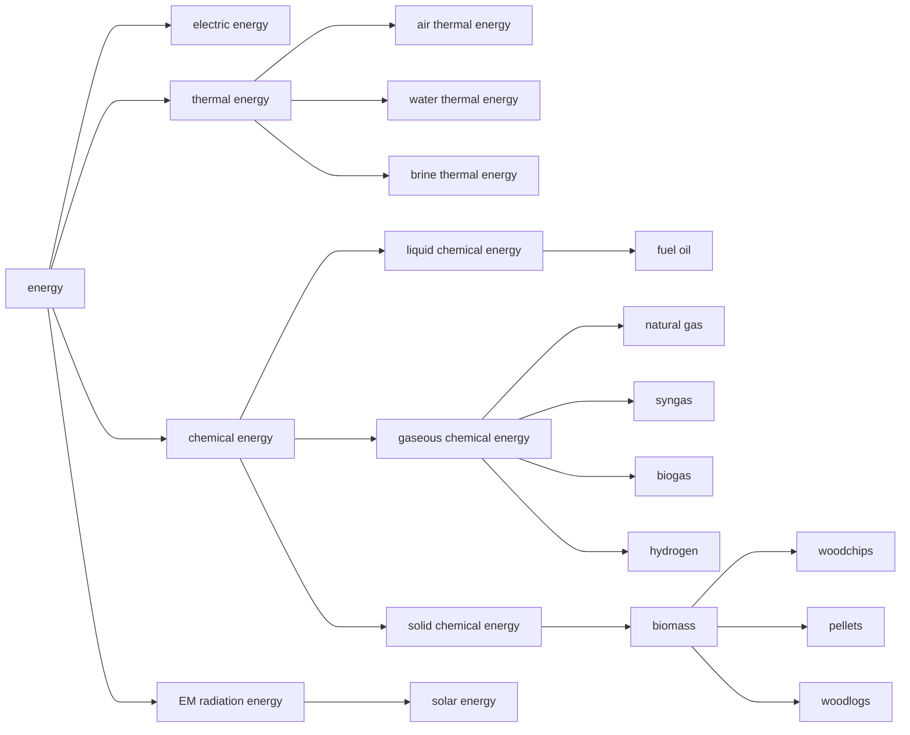
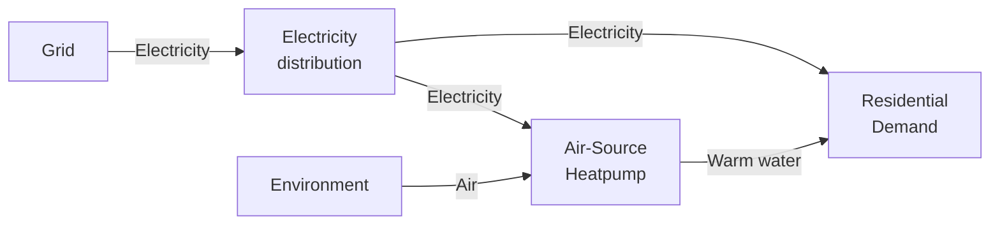
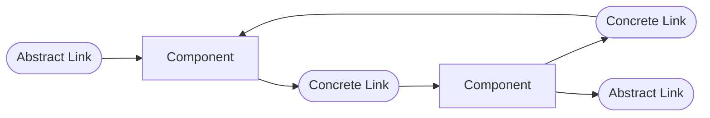
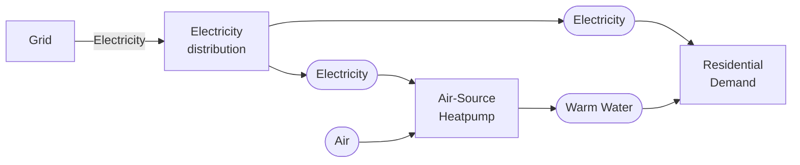
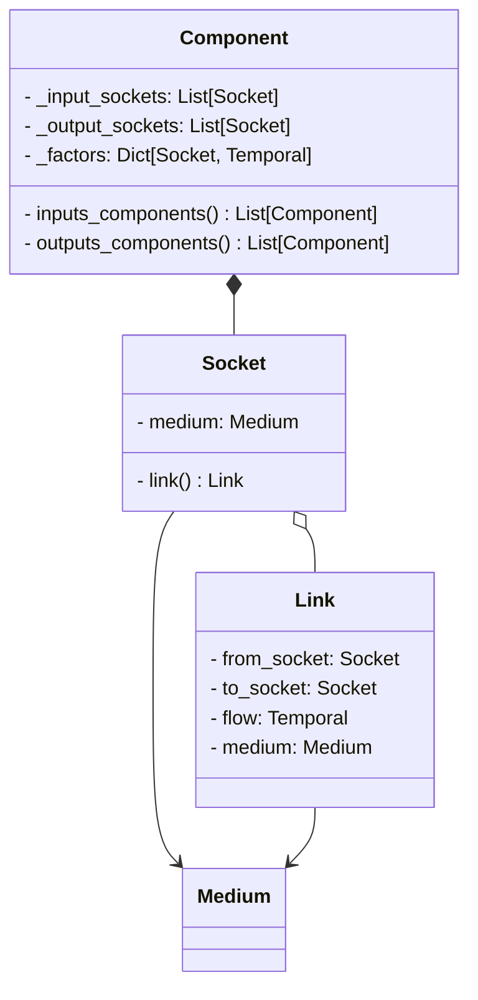
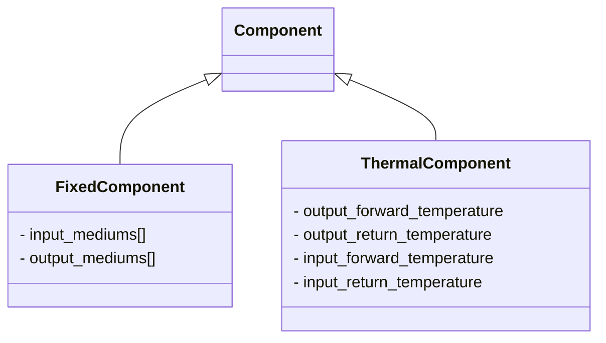

!!! warning "Under Construction"

    This documentation is still under construction and will receive major 
    additions and changes in the future. Please be considerate with us and the 
    documentation. However, if you already have any tips and remarks or if you 
    miss some super important aspects, we'd love to hear from you.

# Components and Energy Flow

## Introduction

Arguably the most essential viewpoint on energy systems might be the topology of energy flows and conversion. In Odeon, these aspects are covered in a layer called **FANTOM** (**F**low **AN**d **TO**pology **M**odel). The building blocks of Fantom are

- Mediums,
- Components,
- Sockets, and
- Link

## Mediums

In Odeon, for energy flows, a number of mediums (class `Medium`) is defined. Mediums are organized in a hierarchical structure as depicted below. This structure allows to generalize and aggregate the description of energy flow if necessary.



They can be analyzed by the `MediumManager`.

???+ example "Analyzing Mediums with `MediumManager`"

    ```python
    from odeon.model import Medium, MediumManager

    el = Medium.ELECTRIC_ENERGY
    air = Medium.AIR_THERMAL_ENERGY
    water = Medium.WATER_THERMAL_ENERGY
    th = Medium.THERMAL_ENERGY

    mm = MediumManager()

    mm.specifies(water, th) # returns True
    mm.closest_common_super(water, air) # returns <Medium 'THERMAL_ENERGY'>
    mm.is_linear(el, air) # returns False
    mm.subs(th) # returns [<Medium 'AIR_THERMAL_ENERGY'>, <Medium 'WATER_THERMAL_ENERGY'>,<Medium 'BRINE_THERMAL_ENERGY'>]
    ```

## Components and Links

Take a a look at the following example:



- In this example, we have a graph representation of an energy system with multiple nodes (Electricity distribution, Air-Source Heatpump, Residential Demand and Environment) and edges between them which are qualified by a flow direction and a medium. 
- In Fantom, we can use *components* (class `Component`) to model nodes and *links* (class `Link`) to model edges.
- A component is an object in which energy conversion (including import across system boundaries (like generation, import) and export across system boundaries (like consumption, loss, export)) or storage takes place.
- In the example, the Component "Grid" has no incoming Links meaning that it acts or is described as a *Source*. On the contrary, the Component "Residential Demand" has no outgoing Links and thus can be seen as a *Sink*. The "Air-Source Heatpump" has incoming and outgoing Links making it an *Intermediate Component*. 
- A link is a one-way and lossless energy flow between components. A link can be qualified by an explicit medium (of type `Medium`). If no explicit medium is given, the medium can be guessed from the connected components. Links can be categorized as *concrete* or *abstract*:
  - A concrete link connects two components in a defined direction, i.e. one component is the source and the other one is the target.
  - An abstract link is connected only to one component, either as source or as target.



- Abstract links can be used to model energy flows where either the source or the target is of no interest for us. For example, in the first graph, we could dispose of the node "Environment" because we consider the air thermal energy from there endless and cost-free.
- A component can have any number of incoming and outgoing links, and thus any number of connected components (for the inheriting class `FixedComponent`, the number is fixed, cf. below). These links can be abstract or concrete (depending on whether they are connected to another component on the opposite site)
- For a component, other components connected via incoming or outgoing Links are called *input* and *output components*. Note that for a component, another component can be an input and an output component at the same time if two links with opposite directions exist, as shown in the above example.

A more meaningful example could look like this – again with rectangular boxes depicting Components and rounded boxes depicting Links:



???+ example "Creating and assessing a linked energy system"

    ```python
    from odeon.model import Component, Socket, Link, Medium

    electricity_distribution = Component()
    grid = Component()
    residential_demand = Component()
    ashp = Component()
    
    grid.add_output(electricity_distribution, medium=Medium.ELECTRIC_ENERGY)
    electricity_distribution.add_output(residential_demand, medium=Medium.ELECTRIC_ENERGY)
    ashp.add_input(electricity_distribution, medium=Medium.ELECTRIC_ENERGY)
    ashp.add_output(residential_demand, medium=Medium.WATER_THERMAL_ENERGY)

    grid.is_source # returns True
    ashp.is_intermediate # returns True
    residential_demand.is_sink # returns True

    electricity_distribution.following_components # returns ashp and residential_demand´
    ```

## Sockets

To describe the links that are connected to a component, Fantom makes use of so-called sockets (class `Socket`). A socket can be seen as the gate or the connection point between a component and a link. An incomplete class diagram could look like this:



As shown, a component doesn't directly know the connected links. Rather, it has a number of sockets which in turn can know links.
This can be used to 


In the code snippet, we have omitted the ambient air intake for the air-source heat pump. If we want to model

## Flows and factors

Any link – concrete just as abstract – can store a `Timeseries` describing the flow. Techically, this flow could be anything (water, CO2, money, ...) but it is adviced to only use it to describe net energy flows. What exactly flows through the link is described by its `Medium`. Note that in Odeon, a `Timeseries` can also have only an absolute part, making no statement about the temporal behaviour throughout the validity period. Flows are divided into *Inflow*s and *Outflow*s for inlinks and outlinks respectively.

Any components stores a factor per incoming and per outgoing link (*Infactor*s and *Outfactor*s). These factors are constrained to be positive reals. A factor describes the conversion ratio of the flow to the Component, i.e. for an _Inflow_, which part of a flow actually "arrives" at the Component, and for an _Outflow_, which part of the "activity" of the Component is emitted as output flow. This interpretation could be expressed as follows, with $i$ being all Inflows and $o$ being all Outflows:

$$
\sum_{i}\frac{\text{Flow}_i}{\text{Factor}_i} = \sum_{o}\frac{\text{Flow}_o}{\text{Factor}_o}
$$

Please note, however, that FANTOM does not carry out any calculations or simulations – the above relation is a mere recommendation on how to use infactors and outfactors.

## Types of components

In Odeon, some general types of `Component`s exist:



- The `FixedComponent` has predefined Slots for incoming and outgoing Mediums. E.g. the `FixedComponent` "air-source heatpump" could be defined by ingoing Mediums "electricity", "ambient air" and outgoing Medium "warm water". Any connection by Links carrying other Mediums would be rejected.

#### ThermalComponent