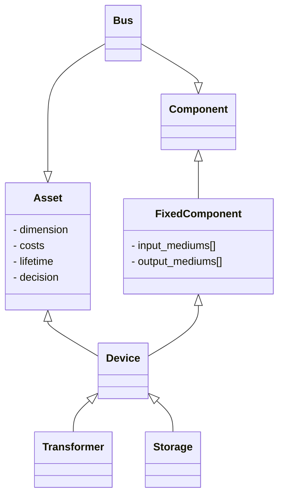

!!! warning "Under Construction"

    This documentation is still under construction and will receive major 
    additions and changes in the future. Please be considerate with us and the 
    documentation. However, if you already have any tips and remarks or if you 
    miss some super important aspects, we'd love to hear from you.

!!! warning "To-dos"

    - Describe device types
    - Remove description of Asset

# Devices

In Odeon, if we mix a `FixedComponent` with an `Asset`, we get a `Device`. An `Asset` is used to describe economic and decision-related properties of anything. Consequently, a `Device` is the blend of an economic and a flow-based description of any technical device. 

## Introduction

- Dimension as nominal size
- Relevant inherited attributes: Geometry

## Device types

- Demands, including EV charging and heating distribution
- Storages
- Power plants and CHPs
- Thermal devices
- (External) energy supplies
- Networks and distribution