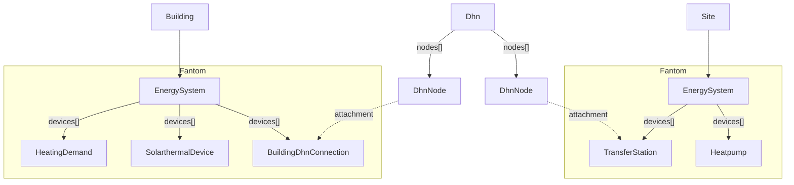
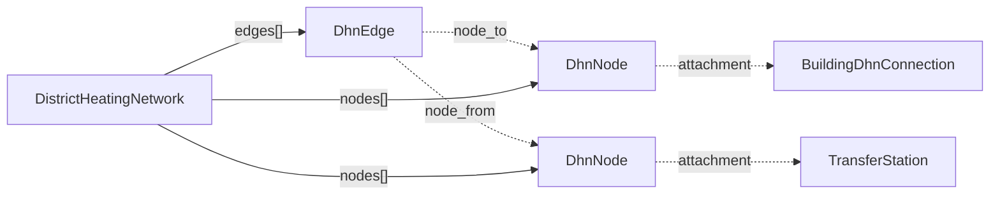
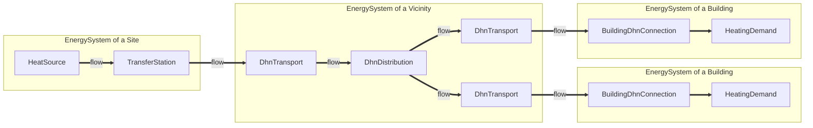
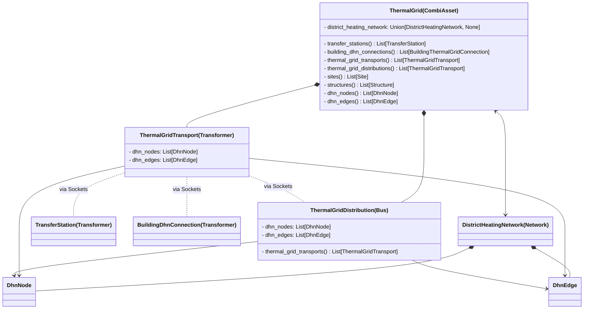
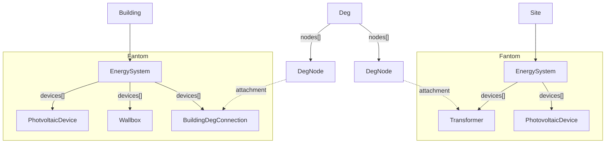

!!! warning "Under Construction"

    This documentation is still under construction and will receive major 
    additions and changes in the future. Please be considerate with us and the 
    documentation. However, if you already have any tips and remarks or if you 
    miss some super important aspects, we'd love to hear from you.

# Integrated Modelling

## Linking buildings and/or central devices with district heating networks

Attachments to `DhnNodes` can be

- `Building`s
- `BuildingDhnConnection`s

to depict buildings connected to the district heating network, or

- `Site`s
- `TransferStation`s

to depict central devices and production sites connected to the district heating network. The former of each represent a more general modeling style

An example could look like this - the edges between the network nodes are not shown:



## Describing district heating networks by `Device`s, or by `Pipe`s

### Representation #1: By `DhnEdge`s and `DhnNode`s with attachments. 

By this approach, network topology and attributes like pressures, velocities etc. can be modelled in detail



### Representation #2: By `Device`s

With this approach, topology is neglected and distribution is described in a star-like manner from a central `DhnDistribution` object (Bus, lossless) and `DhnTransport` connectors (Transformers, lossy). This approach is more focused on economic properties and energy system-level flows than on technical and geometrical properties of individual pipes.



At the same time, A `ThermalGrid` (which is a `CombiAsset`) is the parent of the `ThermalGridTransport`s, `ThermalGridDistribution`s. This allows to set economic properties to the `ThermalGrid` as well to its sub-assets.

A `ThermalGrid` can contain any number of `ThermalGridTransport`s and `ThermalGridDistribution`s. It's the user's responsibility to make sure that these are linked in a correct way, especially in a way that is not contradicting to any topological representation of the network by nodes, edges, and attachments.




The properties `dhn_nodes` and `dhn_edges` on the classes `ThermalGridDistribution` and `ThermalGridTransport` can be used to store information on which nodes and edges (and junctions and pipes) are represented by each Device.

It's noteworthy that `ThermalGridTransport`s and `ThermalGridDistribution`s could be used to exactly mirror the topology formed by `DhnEdge`s and `DhnNode`s, this would be the case if all `DhnEdge`s map to exactly one `ThermalGridTransport` and vice versa, and all `DhnNode`s map to exactly one `ThermalGridDistribution` and vice versa.


## Linking buildings and/or central devices with electricity grids




## Placing devices in the vicinity

```mermaid
flowchart TD
    Vicinity --> EnergySystem3[EnergySystem]
    EnergySystem3 -- devices[] --> ChargingStation
``````
    