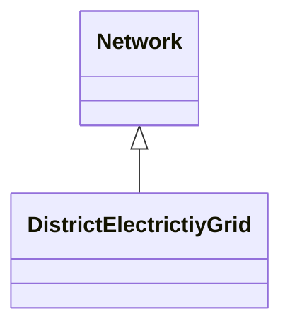
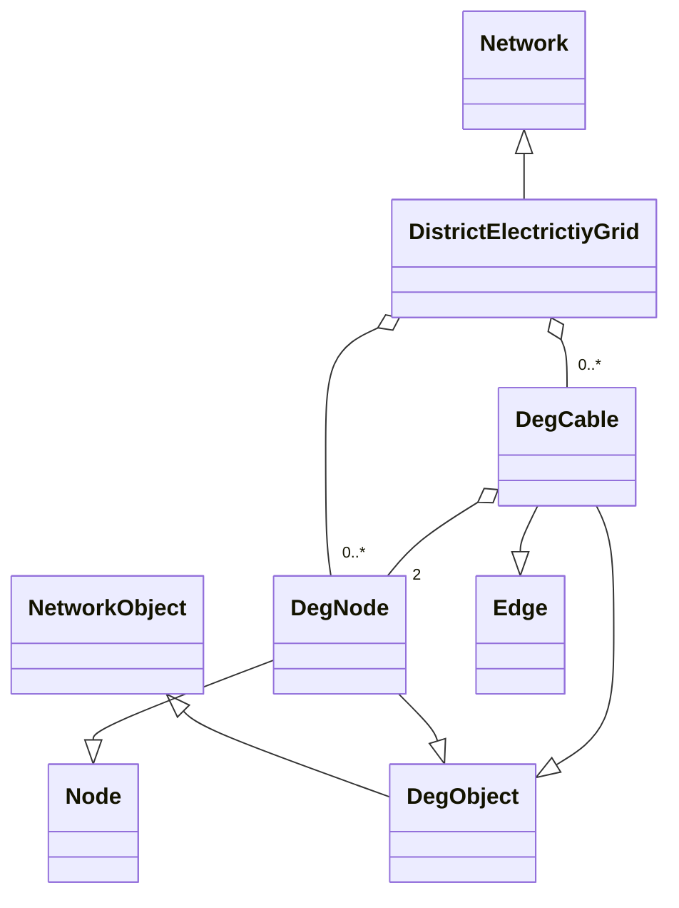

!!! warning "Under Construction"

    This documentation is still under construction and will receive major 
    additions and changes in the future. Please be considerate with us and the 
    documentation. However, if you already have any tips and remarks or if you 
    miss some super important aspects, we'd love to hear from you.

# DistrictElectricityGrid

## Class overview 

### DistrictElectricityGrid
DistrictElectricityGrid represents the entire electricity grid network. It provides methods for advanced electricity grid analysis, such as searching for nodes based on connected devices and creating GeoDataFrames with insights into the grid.
- Methods:
    - add_nodes([DegnNode]): Adds a list of DegNode instances to the grid.
    - remove_nodes([DegnNode]): Removes specified DegNode instances from the grid.
    - add_cables([DegCable]): Adds a list of DegCable instances to the grid.
    - remove_cables([DegCable]): Removes specified DegCable instances from the grid.
    - get_lgs_nodes(): Retrieves lists of load nodes, generator nodes, and storage nodes.
    - to_node_gdf(): Converts node data into a GeoDataFrame.
    - to_transformer_gdf(): Creates a GeoDataFrame with transformer information.
    - to_transformer_station_gdf(): Creates a GeoDataFrame with transformer station information.
    - to_edge_gdf(): Converts edge (cable) data into a GeoDataFrame.
    - get_transformer_nodes(): Retrieves nodes that have transformers connected.
    - get_all_trafos_in_deg(): Collects all transformers present in the grid.
    - get_nodes_by_connection_types([Type]): Retrieves nodes with connected devices of specified types.
    - create_component_df(): Creates a DataFrame summarizing component data in the grid.


### DegNode
DegNode represents a node in the district electricity grid. 
- Properties:
    - _voltage: A time series of voltage levels at the node.
    - demand: Summed electricity demands connected to the node.
    - storage: Summed storage profiles connected to the node.
    - gen: Summed generation profiles connected to the node.

- Methods:
    - connected_devices_of_type(Type): Returns a list of connected devices of a specified type. 
    - get_trafos_in_node(): Retrieves transformers connected to the node.
    - get_flows_by_attached_component(Literal["load", "gen", "storage"]): Retrieves flows by the type of attached component.
    - get_el_bus_from_attachment(): Retrieves the electricity bus connected to the node's attachment.

### DegCable
DegCable represents a cable (edge) in the district electricity grid
- Properties:
    - lineload_percent: Time series representing the line load percentage.
    - parallel: Number of parallel lines (default is 1).
    - type: Type of the cable. 
    - max_current: Maximum current the cable can handle.


## Set up model overview
- In Odeon, the DistrictElectricityGrid belongs to the superclass of Network:
    - DistrictElectricityGrid is based on a Network object
    - With a DistrictElectricityGrid, an electricity grid can be represented as a node edge model
    - The `DegNode` class corresponds to the `nodes`
    - The `DegCable` class corresponds to the `edges`



### Element overview
- The following components are required to create a DistrictElectricityGrid: 
    - `DegNode` which inherits from the `Node` class
    - `DegCable` which inherits from the `Edge` class
    - A `DegCable` needs two `DegNodes` 

- A simple structure and its creation of a DistrictElectrcityGrid is shown below.

???+ example "Creating a DistrictElectrcityGrid with DEGNodes and DEGCables"

    ```python
    from odeon.model import DistrictElectricityGrid, DegNode, DegCable, Geometry, LinestringGeometry
    from shapely import Point, LineString

    # Creating the components
    deg = DistrictElectricityGrid()
    deg_node_1 = DegNode(geometry=Geometry(shape=Point([0, 0])))
    deg_node_2 = DegNode(geometry=Geometry(shape=Point([2, 3])))
    deg_cable_1 = DegCable(geometry=LinestringGeometry(shape=LineString([Point([0, 0]), Point([2, 3])])),
            node_from=deg_node_1,
            node_to=deg_node_2,
        )

    nodes = [deg_node_1, deg_node_2]
    cables = [deg_cable_1]

    deg.add_nodes(nodes)
    deg.add_cables(cables)
    ```


## Application example

The voltage attribute in the DegNode and the lineload attribute in the DegCable are set automatically in the Electra tool after a load flow silulation. The corresponding time series can be queried for each opject.

???+ example "TimeSeries voltage and line_load"

    ```python
    from odeon.model import DistrictElectricityGrid, DegNode, DegCable, Geometry, LinestringGeometry
    from shapely import Point, LineString

    deg = DistrictElectricityGrid()
    deg_node_1 = DegNode(geometry=Geometry(shape=Point([0, 0])))
    deg_node_2 = DegNode(geometry=Geometry(shape=Point([2, 3])))
    deg_cable_1 = DegCable(geometry=LinestringGeometry(shape=LineString([Point([0, 0]), Point([2, 3])])),
            node_from=deg_node_1,
            node_to=deg_node_2,
        )

    nodes = [deg_node_1, deg_node_2]
    cables = [deg_cable_1]

    deg.add_nodes(nodes)
    deg.add_cables(cables)

    time_series_node = deg_node_1.voltage
    time_series_cable = deg_cable_1.lineload_percent
    ```

The time series of the attachments can be queried at a DegNode. A difference can be made between the different types: gen, storage, demand. In addition, all objects of a type that are connected to a node can be queried.

???+ example "Methods of DEGNode"

    ```python
    from odeon.model import DistrictElectricityGrid, DegNode, DegCable, Geometry, LinestringGeometry, WindpowerDevice
    from shapely import Point, LineString

    deg = DistrictElectricityGrid()
    deg_node_1 = DegNode(geometry=Geometry(shape=Point([0, 0])))
    deg_node_2 = DegNode(geometry=Geometry(shape=Point([2, 3])))
    deg_cable_1 = DegCable(geometry=LinestringGeometry(shape=LineString([Point([0, 0]), Point([2, 3])])),
            node_from=deg_node_1,
            node_to=deg_node_2,
        )

    nodes = [deg_node_1, deg_node_2]
    cables = [deg_cable_1]

    deg.add_nodes(nodes)
    deg.add_cables(cables)

    summed_demand = deg_node_1.demand
    summed_timeseries_storage = deg_node_1.storage
    summed_timeseries_gen = deg_node_1.gen
    list_windpower_devices = deg_node_1.connected_devices_of_type(WindpowerDevice)

    ```

The discrivt network can be transferred to a geodataframe. The following methods are provided for an easy transfer.

???+ example "Transfer DEG to GeoDataFrame"

    ```python
    from odeon.model import DistrictElectricityGrid, DegNode, DegCable, Geometry, LinestringGeometry
    from shapely import Point, LineString

    deg = DistrictElectricityGrid()
    deg_node_1 = DegNode(geometry=Geometry(shape=Point([0, 0])))
    deg_node_2 = DegNode(geometry=Geometry(shape=Point([2, 3])))
    deg_cable_1 = DegCable(geometry=LinestringGeometry(shape=LineString([Point([0, 0]), Point([2, 3])])),
            node_from=deg_node_1,
            node_to=deg_node_2,
        )

    nodes = [deg_node_1, deg_node_2]
    cables = [deg_cable_1]

    deg.add_nodes(nodes)
    deg.add_cables(cables)

    # Creates a GeoDataFrame containing information about all nodes, including voltage deviations.
    node_gdf = deg.to_node_gdf()

    # Creates a GeoDataFrame with information about all transformers in the grid.
    transformer_gdf = deg.to_transformer_gdf()

    # Creates a GeoDataFrame that aggregates transformer information by transformer station, showing the maximum loaded transformer in each station.
    transformer_station_gdf = deg.to_transformer_station_gdf()

    # Creates a GeoDataFrame containing information about all cables, including line loads.
    edge_gdf = deg.to_edge_gdf()

    ```

Some methods that exist for the individual DegNodes can also be used directly on the DistrictElectricityGrid for greater convenience. 

???+ example "Query DistrictElectricityGrid"

    ```python
    from odeon.model import DistrictElectricityGrid, DegNode, DegCable, Geometry, LinestringGeometry, HeatPump
    from shapely import Point, LineString

    deg = DistrictElectricityGrid()
    deg_node_1 = DegNode(geometry=Geometry(shape=Point([0, 0])))
    deg_node_2 = DegNode(geometry=Geometry(shape=Point([2, 3])))
    deg_cable_1 = DegCable(geometry=LinestringGeometry(shape=LineString([Point([0, 0]), Point([2, 3])])),
            node_from=deg_node_1,
            node_to=deg_node_2,
        )

    nodes = [deg_node_1, deg_node_2]
    cables = [deg_cable_1]

    deg.add_nodes(nodes)
    deg.add_cables(cables)

    # Searches the grid for nodes with connected devices and sorts them into lists of load nodes, generator nodes, and storage nodes.
    load_nodes, gen_nodes, storage_nodes = deg.get_lgs_nodes()

    # Retrieves a list of nodes that have transformers connected to them.
    transformer_nodes = deg.get_transformer_nodes()

    # Collects all transformers present in the district electricity grid.
    transformers = deg.get_all_trafos_in_deg()

    # Retrieves nodes that have devices of the specified types connected to them.
    nodes_with_heatpumps = deg.get_nodes_by_connection_types(Heatpump)
    ```