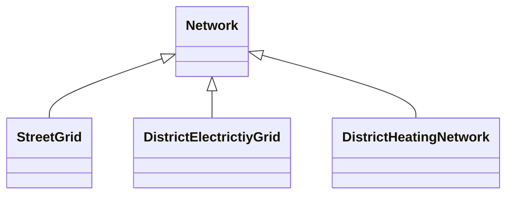
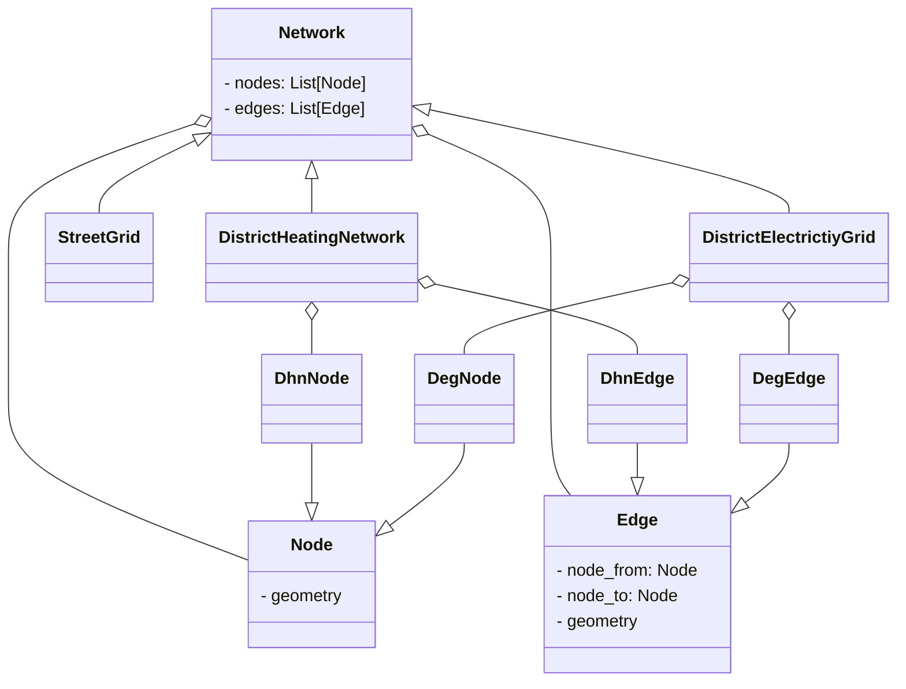
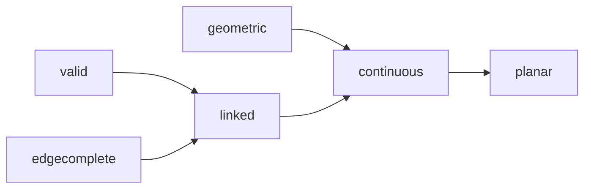

!!! warning "Under Construction"

    This documentation is still under construction and will receive major 
    additions and changes in the future. Please be considerate with us and the 
    documentation. However, if you already have any tips and remarks or if you 
    miss some super important aspects, we'd love to hear from you.

!!! warning "To-dos"

    - check examples
    - Add geopandas example

# Network

## General

### Network subclasses

- In Odeon, networks are used to represent a range of infrastructures:
  - The project's street network can be described by a `StreetGrid`
  - An electricity grid can be described by a `DistrictElectricityGrid` – see page [Electricity Grid](electricity_grid.md) for more details
  - For district heating networks, the class `DistrictHeatingNetwork` exists – see page [Thermal Grid](thermal_grid.md) for more details
  - Any network can be described by the class `Network` which acts as base class for the above classes. It will be presented in the following.



### Element overview

<!-- prettier-ignore-start -->

- The data structure of a `Network` is defined as follows:
    * For `Node`s and `Edge`s contained in a `Network`, this `Network` is the  parent.
    * A `Node` is optionally described by a `Geometry` (containing a Shapely  Point geometry as shape)
    * An `Edge` is optionally described by a starting `Node`, an end `Node`,  and/or a `Geometry` (containing a Shapely Linestring geometry as shape).
    * A `Node` can have an attachment which can be any other Odeon `Object` (e.g.  a building, a device etc.)
    * Network objects (`Node`s and `Edge`s) can belong to any number of  partitions. A partition is a subset of a network identified by a string.

<!-- prettier-ignore-end -->




???+ example "Creating a Network with Nodes and Edges"

    ```python
    from odeon.model import Network, Node, Edge, Geometry, Building
    from shapely import Point, LineString

    network = Network()
    node1 = Node(geometry=Geometry(shape=Point(0, 0)))
    node2 = Node(geometry=Geometry(shape=Point(2, 3)), attachment=Building())
    edge = Edge(node_from=node1, node_to=node2, geometry=Geometry(shape=LineString([[0,0], [2,3]])))

    network.add_edges(edge) # will automatically add node1 and node2

    # access edges:
    network.edges

    # access edge's nodes:
    networks.edges[0].nodes

    # access nodes:
    network.nodes

    # access geometries:
    network.nodes[0].geometry # returns Geometry
    network.nodes[0].geometry.shape # returns Shapely Point

    # access attachments:
    network.nodes[1].attachment # returns Building
    ```

### Network classification

There are several predicates for `Network`s (cf. API documentation).

| Predicate                          | Definition                                                                                                                                                              |
| ---------------------------------- | ----------------------------------------------------------------------------------------------------------------------------------------------------------------------- |
| valid                              | all `Node`s referenced in the network's `Edge`s must be stored as `Node`s, too.                                                                                         |
| edgecomplete                       | all `Edge`s have a origin and a target `Node`                                                                                                                           |
| linked                             | *valid* and *edgecomplete*, and each `Node` is referenced by at least one `Edge`                                                                                        |
| geometric                          | all `Node`s have Point geometries and all `Edge`s have LineString geometries                                                                                            |
| doublet-free considering direction | for each `Edge`, no second edge exists with the same origin and target `Node`                                                                                           |
| doublet-free ignoring direction    | for each `Edge`, no second edge exists with the same origin and target `Node` or vice versa.                                                                            |
| continuous                         | *geometric* and *linked*, and the (linestring) geometry of each edge touches the (point) geometries of `node_from`/`node_to` at the first/last vertex of the linestring |
| planar                             | *continuous*, and no node geometries are identical (touch/congruent), and no edge geometries intersect (cross)                                                          |



### Alternative representations and adapters

#### Networkx

- A Network in Odeon can be expressed as a networkx _Graph_ and _DiGraph_.
- In order to export an Odeon `Network` to a _Graph_, the network needs to be valid, edge-complete and doublet-free ignoring direction. The graph can be accessed via `<Network>.graph`.
- In order to export an Odeon `Network` to a _DiGraph_, the network needs to be
  valid, edge-complete and doublet-free considering direction. The digraph can be accessed via `<Network>.digraph`
- In the resulting Graph, networkx nodes will be represented by the IDs of the `Network`'s `Node`s.
- The networkx topology is not coupled to the Odeon `Network`: After the moment of the Graph creation/access, any further changes in the `Network` (adding or removing Edges, Nodes, and links between them) won't be translated to the Graph, or vice versa.

???+ example "Exporting a Network to Networkx objects"

    ```python
    from odeon.model import Network, Node, Edge, Geometry, Building
    from shapely import Point, LineString

    network = Network()
    node1 = Node(geometry=Geometry(shape=Point(0, 0)))
    node2 = Node(geometry=Geometry(shape=Point(2, 3)), attachment=Building())
    edge = Edge(node_from=node1, node_to=node2, geometry=Geometry(shape=LineString([[0,0], [2,3]])))

    network.add_edges(edge) # will automatically add node1 and node2

    # TODO check networkx commands
    graph = network.graph # access the (read-only) networkx Graph
    graph.nodes(data=True)[node1.id]["object"] # returns node1
    graph.nodes(data=True)[node2.id]["object"].attachment # returns the Building
    graph.edges(data=True, u=node1.id, v=node2.id)["object"] # returns edge
    graph.edges(data=True, u=node1.id, v=node2.id)["length"] # returns the length of the underlying LineString shape
    ```

#### Geopandas and Geopackage

- A network can be exported to a GeoDataFrame with `<Network>.to_edge_gdf()` and `<Network>.to_node_gdf()`.
- A network can be exported to a GeoPackage with <mark>Todo</mark>
