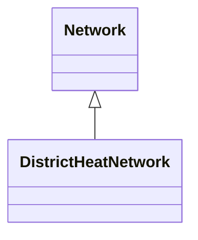
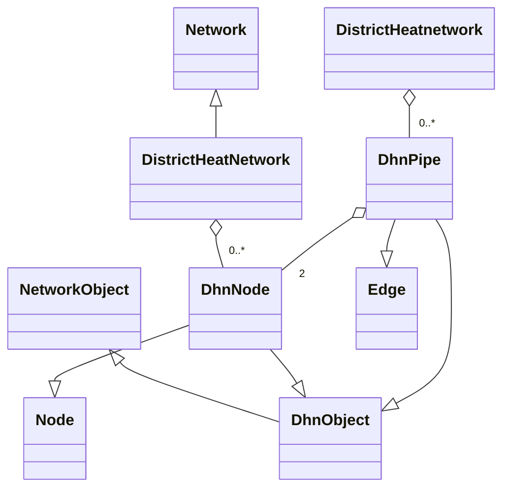

!!! warning "Under Construction"

    This documentation is still under construction and will receive major 
    additions and changes in the future. Please be considerate with us and the 
    documentation. However, if you already have any tips and remarks or if you 
    miss some super important aspects, we'd love to hear from you.

# DistrictHeatNetwork

## Class overview 

### DistrictHeatNetwork

DistrictHeatNetwork represents the entire thermal grid network. It provides methods for advanced thermal grid analysis, such as searching for nodes based on connected devices.

- Methods:
    - add_nodes([DhnNode]): Adds a list of DhnNode instances to the grid.
    - remove_nodes([DhnNode]): Removes specified DhnNode instances from the grid.
    - add_pipe([DhnPipe]): Adds a list of DhnPipe instances to the grid.
    - remove_pipe([DhnPipe]): Removes specified DhnPipe instances from the grid.
    - set_pipe_supply
    - set_pipe_return
    - remove_pipe_supply
    - remove_pipe_return
    
### DhnNode
DhnNode represents a node in the district thermal grid. 
- Properties:
    - junctions: 
    - junction_supply: 
    - junction_return: 
    - 

- Methods:
    - set_junction_supply(junction):  
    - remove_junction_supply(): 
    - set_junction_return(junction): 
    - remove_junction_return(): 
    - remove_junctions():

### DhnPipe
DhnPipe represents a pipe (edge) in the district thermal grid
- Properties:
    - network:
    - edge: 
    - junction_from: 
    - junction_to: 
    - fluid:
    - temperature_loss:
    - max_temperature_loss:
    - pressure_loss:
    - max_pressure_loss:
    - max_mean_fluid_velocity:
    - pressure_loss_per_length:
    - heat_loss:
    - max_heat_loss:

## Set up model overview
- In Odeon, the DistrictHeatNetwork belongs to the superclass of Network:
    - DistrictHeatNetwork is based on a Network object
    - With a DistrictHeatNetwork, an thermal grid can be represented as a node edge model
    - The `DhnNode` class corresponds to the `nodes`
    - The `DhnPipe` class corresponds to the `edges`

### Element overview
- The following components are required to create a DistrictHeatNetwork: 
    - `DhnNode` which inherits from the `Node` class
    - `DhnPipe` which inherits from the `Edge` class
    - A `DhnPipe` needs two `DhnNodes` 

## Application example
An application example will be added here.