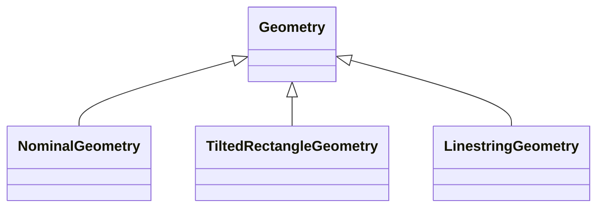

!!! warning "Under Construction"

    This documentation is still under construction and will receive major 
    additions and changes in the future. Please be considerate with us and the 
    documentation. However, if you already have any tips and remarks or if you 
    miss some super important aspects, we'd love to hear from you.

# Geometry

## General

### Coordinate reference systems (CRS)

- In Odeon, all geometric data is assumed to be in cartesian coordinate reference systems (CRS), i.e. it is assumed that x- and y-coordinates are everywhere (roughly) perpendicular to each other and represent (roughly) one meter on Earth per unit (which, for example, is not the case for coordinate systems based on latitude and longitude).
- As district planning projects usually have a narrower spatial focus of not more than a few kilometers at maximum, it's appropriate to define a local (engineering) coordinate system per project.
- A local coordinate system is entirely defined by its coordinate origin (the Point (0, 0)). First (x) coordinate is the distance in North direction from origin (=Northing), second (y) coordinate is the distance in East direction from origin (=Easting) 

### Projector and boundary

- In order to create a local coordinate system, the Odeon class `Projector` can be used. Every `Project` in Odeon has exactly one `Projector`. A `Projector` stores the origin of the project's local coordinate system, the project's boundary, and supplies functions for coordinate transformations.
- The boundary of a project must be a Shapely Polygon without holes. It is used for various operations. Many procedures rely on the assumption that all objects are located inside this boundary, so make sure to choose it large enough.
- `Projector` stores the project's origin in WGS84 (EPSG:4326), which is the most used geographic coordinate system (with coordinates in longitude and latitude)

???+ example "Using projector to transform coordinates from and to the local CRS"

    ```python
    from odeon.model import Projector
    from shapely import Point

    projector = Projector(origin=[51.446348396, 7.272680998]) # latitude, longitude of Fraunhofer IEG in Bochum
    point1_local = Point(500, 30) # define a point 500 m North and 30 m East of origin TODO verify order
    point_wgs84 = projector.to_wgs84(point1_local, order="lat_lon") # transform to WGS84
    print(point_wgs84) 
    # output: "POINT (51.446617821830856 7.279873006353364)"
    point_local2 = projector.from_wgs84(point_wgs84, order="lat_lon") # should be idential to point_local
    print(point_local2)
    # output: POINT (499.9999999998878 29.999999999327418)
    ```

???+ example "Setting up a new project with a boundary"

    ```python
    from odeon.model import Project
    from shapely import Polygon

    boundary = Polygon(
        [
            [51.446348396, 7.272680998],
            [51.456348396, 7.272680998],
            [51.456348396, 7.282680998],
            [51.446348396, 7.282680998],
        ]
    )
    projector = Projector(
        origin=boundary
    )  
    project = Project(projector=projector)
    ```

### Basic geometry classes

- Odeon provides four basic classes for storing geometries: `Geometry`,
  `NominalGeometry`, `TiltedRectangleGeometry`, `LinestringGeometry`



<!-- prettier-ignore-start -->

- `Geometry` is a basic wrapper for a Shapely geometry. As mentioned, this geometry is assumed to be in a local cartesian coordinate reference system with coordinate order (Norting, Easting). `Geometry` provides methods to tranform this Shapely geometry to a geometry in any CRS, e.g. WGS84 (longitude/latitude), which require a `Projector` instance.
- `NominalGeometry` is intended for storing geometric objects for which nominal data is partly or exclusively present.
    * Nominal data means that the user has knowledge about some aspects of a geometry – for example the area – without knowing or being able to give the exact vertices of the geometry. A stored (nominal) area might also contradict the area of a Shapely Polygon stored in the same `NominalGeometry`.
    * For other attributes like a pair of dimensions, azimuth, height or tilt, the calculation of values based of the stored Shapely geometry (if any) might be ambiguous or subject to interpretation. * While `NominalGeometry` allows to store such geometric (nominal) values, it's also possible to calculate them based on the stored Shapely geometry (if present). For a certain field (e.g. area), the geometry-based calculation will only be applied if no nominal data is given.
- `TiltedRectangleGeometry` is intended for storing rectangles with an azimuth (rotation about the global vertical axis) and a tilt (rotation about one of the rectangle's symmetry axes). In contrast to `NominalGeometry`, `TiltedRectangleGeometry` doesn't allow to store any nominal geometry data. All information will be calculated based on the stored rectangle (inclined and projected area, height, tilt, azimuth, inclined and projected dimensions)
- `LinestringGeometry` is intended for storing (3D) Linestring data. The stored Shapely geometry must be a Shapely `LineString` (with optional z coordinates). `LineStringGeometry` supplies methods for 2D- and 3D-analysis of this linestring, like 3D-length or 3D-distance of terminal vertices.
  
<!-- prettier-ignore-end -->