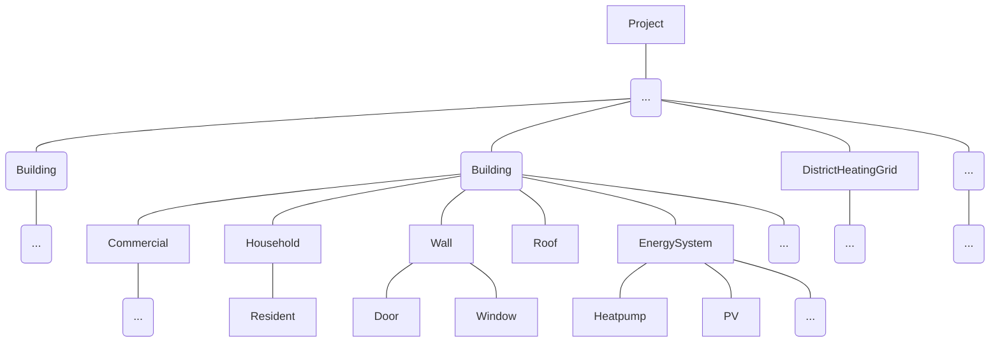
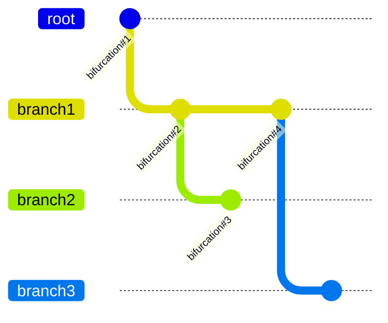
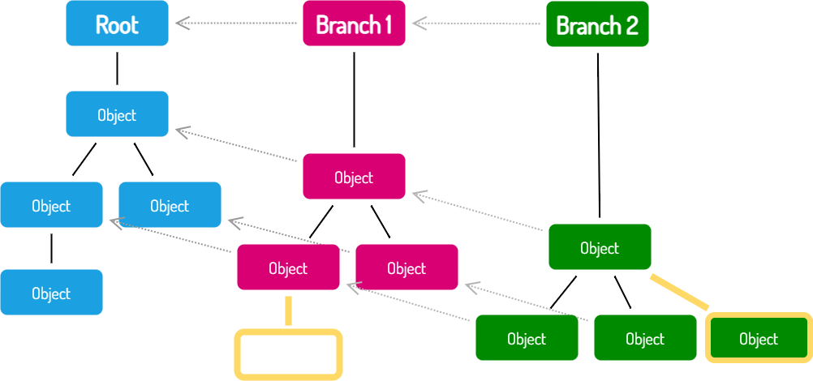

!!! warning "Under Construction"

    This documentation is still under construction and will receive major 
    additions and changes in the future. Please be considerate with us and the 
    documentation. However, if you already have any tips and remarks or if you 
    miss some super important aspects, we'd love to hear from you.

# Projects, Branches and Objects

This page will give a short intoduction about the idea of **Projects in Odeon** and how objects are structured within projects.

## Object Hierarchy

Odeon implements a strict object hierarchy, meaning that every object knows a single object it belongs to (its so called `parent`). For example a `Door` would know the `Wall` it is attached to while this same `Wall` would know the `Building` it belongs to. The highest level of this form of hierarchy is what  we call a `Project`. This parent-child-relation can easily be visualized as a tree structure:

A project therefore "contains" every object that exists in this context while having no upper level respectively parent itself! Because of this this a project is described mainly by only four attributes:

- boundary
- branches
- root
- projector

The `boundary` can be specified as a local or WGS84 polygon that describes the border of the district. Every object that lays inside the polygon is part of the project and - in case of an osm request - will be pulled automatically. To store those information every `Project` has exactly one `Projector`. To learn more about `boundary` and `Projector` please have a look at the corresponding section [Projector and boundary](geometry.md#projector-and-boundary) on the Geometry page.

It is possible to consider several forms of the same district inside one project e.g. one representing the status quo and a second one that describes a Future scenario with a higher renovation rate or a different energy supply system. To be able to depict this a project consists of several `branches`. Every project must contain at least one branch which is the so called `root` branch. 

## Branches

As mentioned above it is possible to have several Branches within one `Project`. Each `Branch` represents a different variant of the same district. This can be used to define different scenarios (e.g. extreme weather conditions), concepts (i.e. different supply options), operating options or different renovation rates. Every `Object` inside a `Branch` is mapped against it's reference object which could be the same `Building`/`Household`/`PhotovoltaicDevice/...` from the `root` branch or from any other `Branch`. The `root` branch is hereby intended to be used to mOdeonl the _base state_ (like status-quo). This mapping makes it easy to compare any branches to each other to track the impact of changes. 

<figure markdown="span">
  { width=600 }
  <figcaption>Exemplary "duplication" of an hierarchy into two Branches which can experience changes, additions and deletions</figcaption>
</figure>

## Objects

An `Object` is the most abstract form of entities in Odeon. Except for a few classes (like `Project` or `Branch`) almost everything in Odeon is an `Object` in terms of inheritance. As an abstract class `Object`s have usefull general  functions and properties with high adaptability. To name some examples: 

- collecting all children of an `Object` (e.g. of a `Building`)
- collecting all children of a specific type (e.g. all `BuildingUnits` of a `Building`)
- collecting all offsprings (= children of children) of an `Object`
- getting the corresponding `Branch` or `Project` the `Object` belongs to
- getting the `Object`s parent

Every `Object` in Odeon has an optional `name` attribute and an unique `id`. IDs are beeing awarded by a simple ID-Manager called `IdAuthority`. Everytime a new `Object` gets created it receives a new id (Integer Counter) from the  `IdAuthority`. This ensures that every ID is unique within one `Project` by  simply incrementing the counter. But since every `Object` stores the information about it's parent, this behaviour can be unwanted in case of copying `Objects`. That is why the class `Object` overrides the Python `__deepcopy__` method. If for example you want to create a copy of a `Household` and the new copy should belong to the same `Building` (`parent`). Because a new `Object` (here `Household`) still  get's created it will get a new ID. As `__deepcopy__` is a recursive method, without overriting it a new `Building` would also be created. In Odeon this get's prevented and thus it is ensured, that the `parent` is set to the same `Building` as the orignal `Household`. 